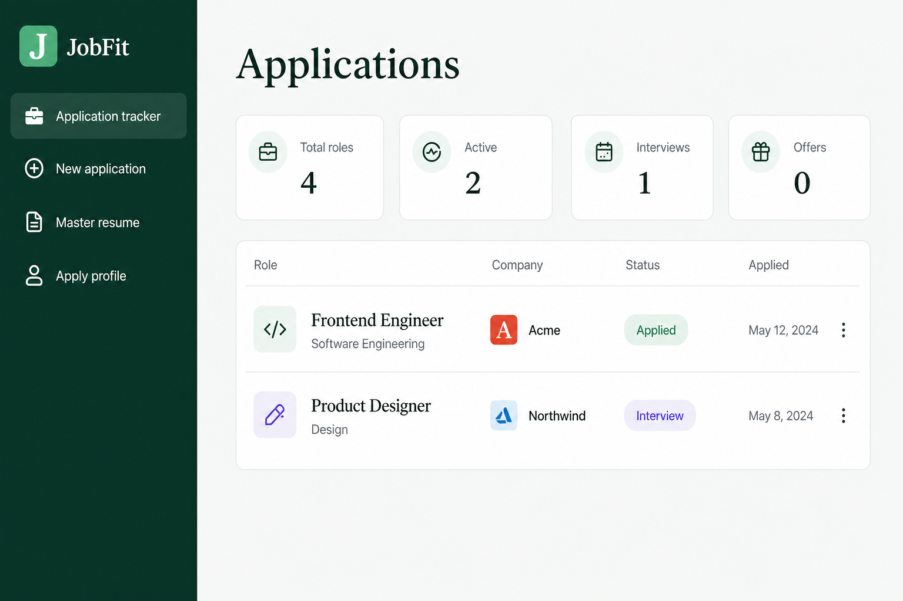
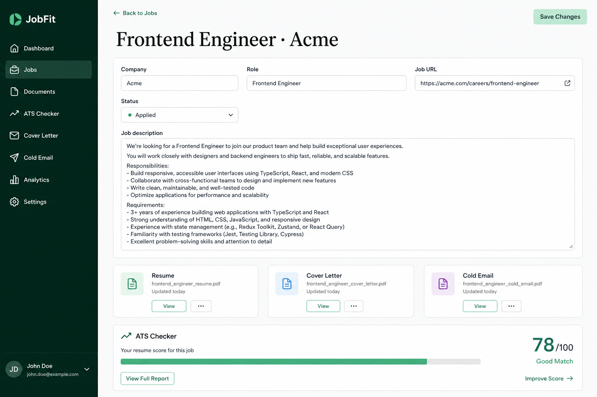
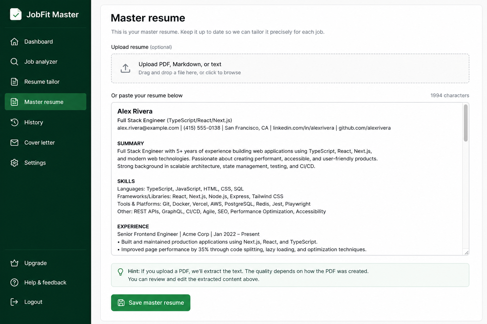

# JobFit

Local-first workspace for a job search: store a master resume, tailor it to a job description, check keyword/format fit, draft a cover letter and cold email, track applications, and fill common form fields from a saved profile.

Nothing is uploaded to a cloud account. Application data lives in SQLite on your machine (`.data/job-helper.db`). AI is optional and only used when you generate a document.

## Screenshots

<p align="center">
  
</p>
<p align="center"><em>Tracker — pipeline, statuses, and every role in one list.</em></p>

<p align="center">
  
</p>
<p align="center"><em>Application — JD, tailored resume, cover letter, cold email, ATS check.</em></p>

<p align="center">
  
</p>
<p align="center"><em>Master resume — paste or upload PDF; tailored versions start here.</em></p>

## What it does

| Area | Behavior |
| --- | --- |
| **Master resume** | Paste Markdown/text or upload a PDF (text is extracted). This is the source of truth for generation. |
| **Applications** | Company, role, JD, URL, status (`draft` → `applied` → `interview` → `rejected` → `offer`), notes, recruiter fields. |
| **Tailored resume** | Rewrites the master resume for the JD. Does not invent jobs, skills, or metrics. |
| **Cover letter / cold email** | Optional drafts from the same facts. |
| **ATS check** | Heuristic keyword + structure score. Not a real Workday/Greenhouse score. |
| **Export** | Download tailored resume as Markdown or PDF. |
| **Apply profile** | Contact fields (name, email, phone, links, address) used by the Chrome extension. |
| **JobFit Fill** | Unpacked Chrome extension: on the job tab, fills **empty** matching inputs. Does not submit. Skips salary, EEO, SSN, and similar. |

Tracker and ATS work without an API key. Generation needs `OPENAI_API_KEY` (or any OpenAI-compatible base URL).

## Tech stack

- **App:** [Next.js](https://nextjs.org/) 13 (App Router), React 18, TypeScript
- **Data:** SQLite via `better-sqlite3` (local file, gitignored)
- **PDF in:** `pdf-parse` (resume upload)
- **PDF out:** `jspdf` (tailored resume download)
- **Generation:** OpenAI Chat Completions API (`gpt-4o-mini` by default)
- **Extension:** Chrome Manifest V3 (`activeTab` + `scripting`; reads `http://localhost:3000/api/profile`)

## Run locally

```bash
npm install
cp .env.example .env.local
```

Put an API key in `.env.local` only if you want document generation.

```bash
npm run dev
```

Open [http://localhost:3000](http://localhost:3000).

```bash
npm test
npm run lint
npm run build
```

## Chrome extension

1. Keep the app running on port 3000.
2. Save an **Apply profile** in the app.
3. Chrome → `chrome://extensions` → Developer mode → **Load unpacked** → select the `extension/` folder.
4. On an application form, click **JobFit Fill** → **Fill this page**. Review every field before you submit.

Workday and other custom widgets may not expose normal inputs; the extension only fills what it can map.

## Privacy

- `.data/` and `.env.local` are gitignored.
- The extension only talks to your local JobFit server.
- Do not commit resumes, PDFs, or personal documents.
